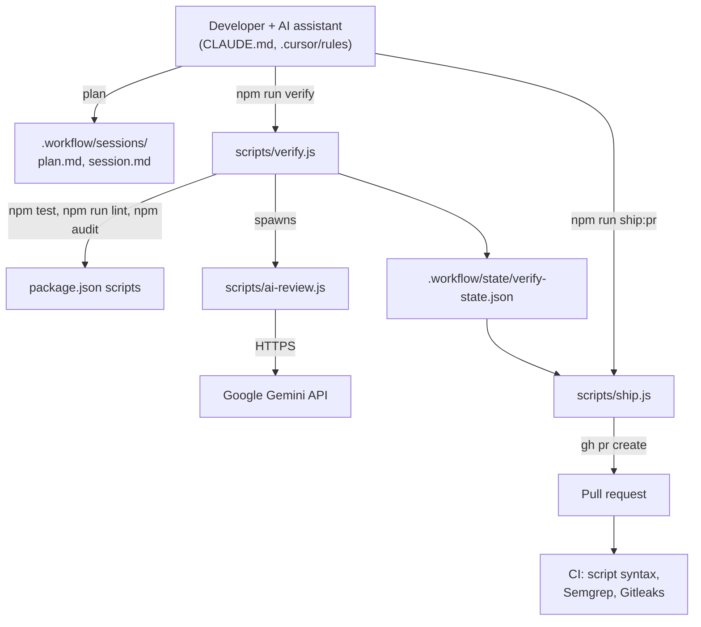

# Project Name

> Brief description of what this project does.

## Quick Start

```bash
# Install dependencies (the template itself has none)
npm install
```

The template ships no application code: `src/` holds only a `.gitkeep`, `package.json` points
`main` at `src/index.js` (create it), and there is no `start` script until you add one. The
`test` and `lint` scripts are placeholders that print a message and exit 0; replace them so
`npm run verify` checks something real.

## Ironclad Workflow

This project uses the **Ironclad Workflow** — a structured 4-phase development process:

```
PLAN -> EXECUTE -> VERIFY -> SHIP
```

### Starting New Work

1. **Create a plan:**
   ```bash
   mkdir -p .workflow/sessions/SESSION-$(date +%Y-%m-%d)-feature-name
   cp .workflow/templates/plan-template.md .workflow/sessions/SESSION-$(date +%Y-%m-%d)-feature-name/plan.md
   ```

2. **Get plan approval** before writing code

3. **Execute** the planned tasks

4. **Verify** with AI code review:
   ```bash
   npm run verify
   ```

5. **Ship** when verification passes:
   ```bash
   npm run ship:pr
   ```

### Workflow Commands

| Command | Description |
|---------|-------------|
| `npm run verify` | Full verification with AI review |
| `npm run verify:skip-ai` | Verify without AI review |
| `npm run ai-review` | Run AI review only |
| `npm run ai-review:diff` | Review git changes only |
| `npm run ai-review:security` | Security-focused AI review |
| `npm run ship` | Validate integrity |
| `npm run ship:pr` | Validate and create PR |

### Environment Setup

Copy `.env.example` to `.env` and add your Gemini API key:

```bash
cp .env.example .env
# Edit .env and add your GEMINI_API_KEY
```

`.env.example` is a tracked dotfile at the repo root (some file browsers hide it).

The workflow scripts read `GEMINI_API_KEY` from the process environment and do not load `.env`
themselves, so export it in your shell (or load `.env` with your own tool) before `npm run verify`.
AI review uses the `gemini-2.5-flash` model.

### Forge PR gate

On the Sovereign Forge, `.github/workflows/ai-review.yml` reviews every PR to `main`
through the review broker and posts a verdict comment as `forgejo-actions`.
`forge-pr merge` refuses a PR without that verdict at its current head. The forge repo
variable `AI_REVIEW_ENABLED` switches the job on (it runs only when the value is `true`),
and the `BROKER_TOKEN` secret authenticates it to the broker. A bad token doesn't skip the
job: the broker rejects it, the job fails with no verdict, and merges stay blocked. On GitHub it
never runs, so a project generated from this template on GitHub gets the file with the
job switched off.

`bin/review-pr.sh` and `bin/blast-radius.py` are byte-identical copies of sovereign-forge's
`bin/`. Don't edit them here: fix them upstream and re-copy.

## Architecture



A rendered diagram is in [`docs/diagrams/project-template.architecture.svg`](docs/diagrams/project-template.architecture.svg)
(source: `docs/diagrams/project-template.architecture.json`).

## Project Structure

```
.
├── src/                    # Source code
├── bin/                    # Forge review gate kit (vendored; don't edit)
├── scripts/                # Ironclad workflow scripts
├── .workflow/              # Workflow documents
│   ├── templates/          # Plan, session, PR templates
│   ├── checklists/         # Security and verification checklists
│   ├── sessions/           # Active session documents
│   └── state/              # Verification state files
├── docs/diagrams/          # Architecture diagram (JSON source, HTML, SVG)
├── .cursor/rules           # Cursor IDE workflow enforcement
├── CLAUDE.md               # AI assistant context
└── package.json
```

## License

MIT
